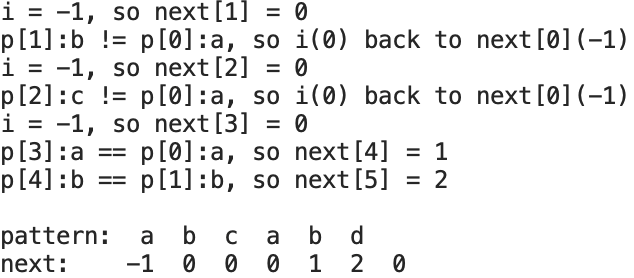

# 程序排错作业

学号：2019211397
姓名：毛子恒

## BUG现象说明

1. 编译时，gcc输出报错信息

    ```
    warning: address of stack memory associated with local variable 'next' returned [-Wreturn-stack-address]
        return next;
               ^~~~
    1 warning generated.
    ```

    运行时，`next`数组中是错误的数据。

2. 

    观察到输出的`next`数组多输出了一个0。

## 查找过程和BUG原因

1. 根据编译器的报错，查找到`build_next`函数中返回`next`指针的值，而`next`所指向的数组是局部变量，定义在16行，函数返回后`next`数组会被释放，该指针指向的值会成为无效的值。
2. 查找输出`next`数组的部分，定位到`print_next`函数，其中49行和53行的循环终止条件为`i <= length`，而实际上数组最后一个有效的值为`length - 1`，因此会访问到未定义的值。

## 修改方式

1. 将16行`next`数组的定义前加`static`限定，或者在堆中申请内存：

    ```C
    int *next = (int *)malloc(length * sizeof(int));
    ```

2. 将49行和53行终止条件改为`i < length`。


